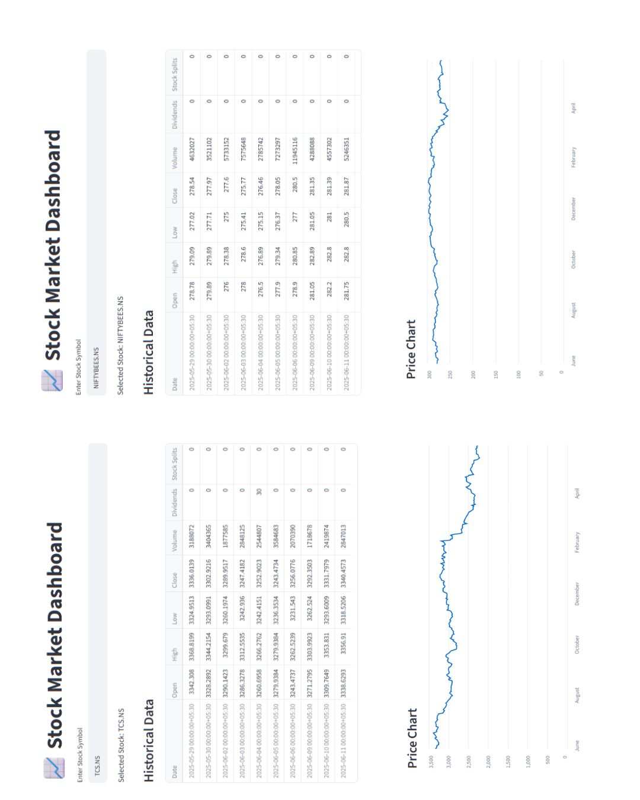
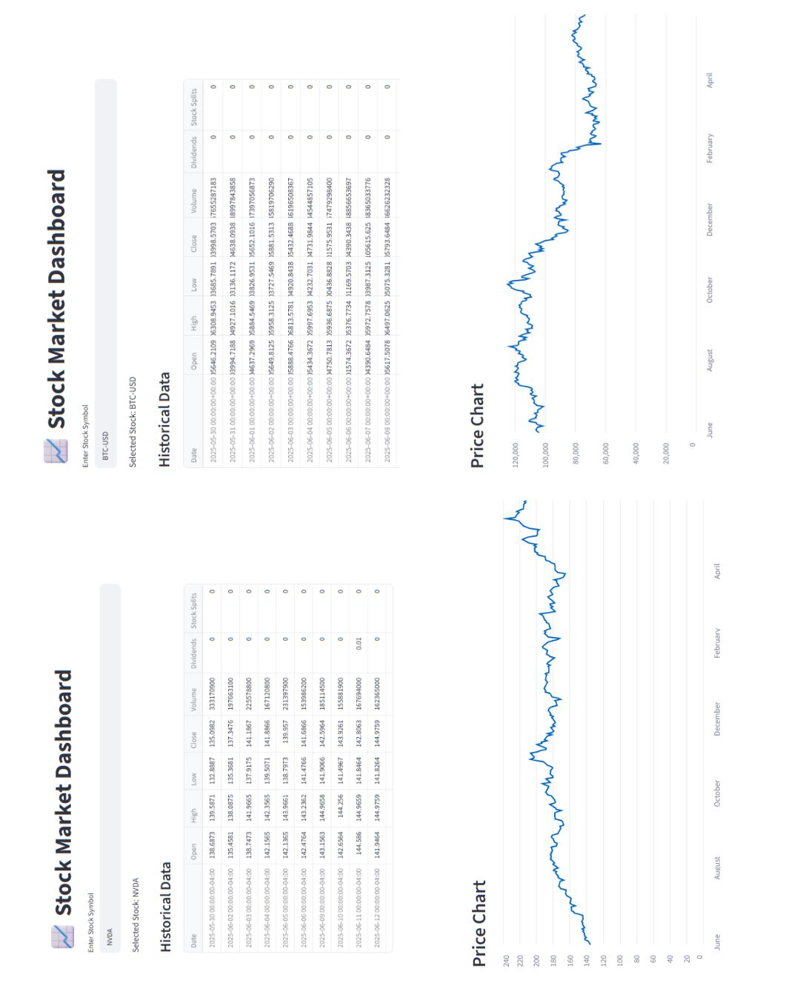

# Stock Market Dashboard 📈

An interactive stock market dashboard built using Python, Streamlit, and Yahoo Finance API. This project enables users to explore historical stock data, visualize price trends, and view key company information through a simple and intuitive interface.

## Features

* Search stocks using ticker symbols
* View 1-year historical stock data
* Interactive stock price visualization
* Display current stock price
* Company information lookup
* Supports Indian stocks, US stocks, ETFs, indices, and cryptocurrencies

## Technologies Used

* Python
* Streamlit
* Pandas
* yFinance

## Project Structure

```text
stock-market-dashboard/
│
├── app.py
├── requirements.txt
├── README.md
└── .gitignore
```

## Supported Examples

### Indian Stocks

* RELIANCE.NS
* TCS.NS
* INFY.NS
* ITC.NS

### US Stocks

* AAPL
* MSFT
* NVDA
* TSLA

### Crypto currencies

* BTC-USD
* ETH-USD

### Indices

* ^NSEI
* ^NSEBANK
  
# Dashboard Preview


